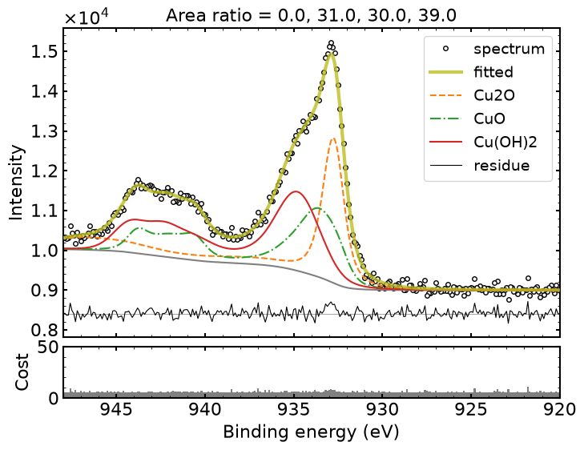
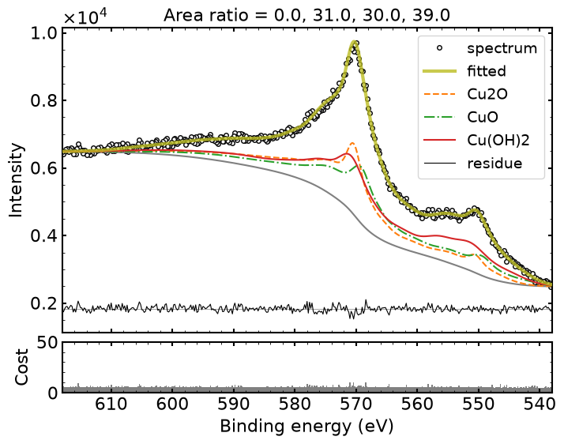

# spec-decomp-ref
Spectral Decomposition via Reference Data
参照データを用いたスペクトル分解ツール




## Requirements

* **OS**: Ubuntu 22.04 LTS
* **Language**: Python >= 3.9

## Installation
`{this repo}/`ディレクトリに移動後：
```bash
uv venv
source .venv/bin/activate
uv sync
```

## Usage
### データの準備

#### 解析対象のデータ
`{this repo}/data/*.csv`に解析対象のCSVファイルを置く。  
複数ファイルに対応可能（{this repo}/data/*.csvのファイルはすべて読み込まれる）。  
一つ一つのcsvファイルはヘッダなしの2カラムデータ形式であること。

#### 参照データ
`{this repo}/db/reference.csv`に参照データCSVシートを置く。ファイル名は`reference.csv`であること。


#### 設定ファイル
`{this repo}/data/config.json`に解析設定のJSONファイルを置く。ファイル名は`config.json`とすること。
テンプレートを以下に示す：
```
{
    "model": {
        "peak": "VoigtPeaks",
        "background": "ShirleyBackground",
        "noise": "PoissonNoise",
        "regularization": "BayesianInformationCriterion"
    },
    "states": ["Cu-metal", "Cu2O", "CuO", "Cu(OH)2"],
    "is_common": {
        "ratio": true,
        "shift": true,
        "sigma": false,
        "gamma": false
    },
    "bounds": {
        "ratio": [-1, 1],
        "shift": [-1.0, 0.5],
        "sigma": [0.9, 1.5],
        "gamma": [0.9, 1.5]
    }
}
```

### 解析プログラムの実行
```bash
python src/main.py
```

## 出力結果
`{this repo}/out/`に解析結果が出力される。

## その他
入出力ファイルの詳細についてはdocsフォルダの資料を参照。

## References
1. R. Murakami, H. Tanaka, H. Shinotsuka, K. Nagata, H. Shouno, H. Yoshikawa, "Development of multiple core-level XPS spectra decomposition method based on the Bayesian information criterion", Journal of Electron Spectroscopy and Related Phenomena. 245 (2020) 147003. https://doi.org/10.1016/j.elspec.2020.147003.
2. R. Murakami, H. Yoshikawa, K. Nagata, H. Shinotsuka, H. Tanaka, T. Iizuka, H. Shouno, Automatic estimation of unknown chemical components in a mixed material by XPS analysis using a genetic algorithm, Science and Technology of Advanced Materials: Methods. 2 (2022) 91–105. https://doi.org/10.1080/27660400.2022.2061878.

## Author
* **Ryo Murakami, Hiroshi Shinotsuka**
* NIMS
